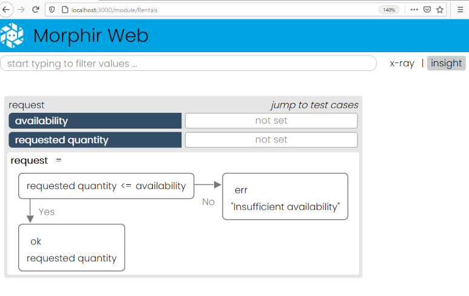
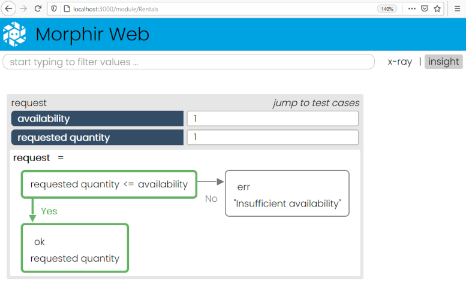
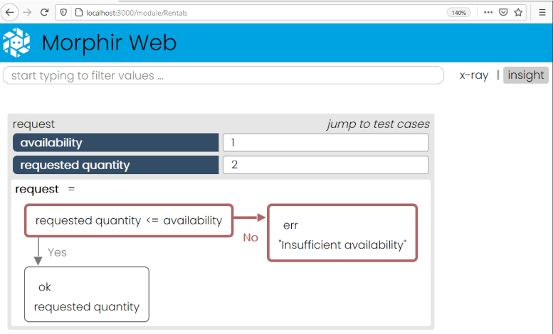

# Building Your First Logic Model

[Source Code](https://github.com/stephengoldbaum/morphir-examples/tree/master/tutorial/step_1_first_logic)

We'll start out with a very simple example of modeling logic: whether we have enough surfboards to satisfy a rental request. First up, let's create the Elm source file for our code.

First create the file `src/Morphir/Examples/App/Rentals.elm`. In linux that's:

```
mkdir src/Morphir
mkdir src/Morphir/Examples
mkdir src/Morphir/Examples/App
touch src/Morphir/Examples/App/Rentals.elm
```

We need to update `morphir.json` to reflect our new module. Edit it to add the `Morphir.Example.App` package and the `Rentals` module and like this:

```
{
    "name": "Morphir.Example.App",
    "sourceDirectory": "src",
    "exposedModules": [
        "Rentals"
    ]
}
```

Now edit the `Rentals.eml` file. First, we want to reflect the module (aka namespace). Add:

```Elm
module Morphir.Example.App.Rentals exposing (..)


```

That takes care of the boilerplate. Now we can focus on the business logic. We'll put that into a function:

```Elm
request : Int -> Int -> Result String Int
request availability requestedQuantity =
    if requestedQuantity <= availability then
        Ok requestedQuantity
    else
        Err "Insufficient availability"
```

This is Elm's way of declaring a function. In this case, the function takes the current availability and the requested amount and returns a Result, which is either the quantity to be rented or an error message. At this point, we might want to play around to test that we got everything covered. We can do this with Morphir's developer tools. On the command line, type:

```
morphir-elm make
morphir-elm develop
```

Go ahead and click on the http://0.0.0.0:3000 link (note: you can also find an online example at [Insight Sample](https://finos.github.io/morphir-service)). Click on the "Rentals" link. You should see a page like:



We can test out our logic by trying different values and checking the execution paths below:




### Generating code

You might be interested in using this logic in a larger application. One option is to use the base Scala generator to transpile to a Scala library. This would allow you to use it as you would any other Scala library. To generate into the `dist` folder default, run:

```
morphir-elm gen
```

The full source code for the model can be found at [Rentals.elm](https://github.com/stephengoldbaum/morphir-examples/blob/master/tutorial/step_1_first_logic/src/Morphir/Example/App/Rentals.elm)

That wraps up our first Morphir model!
